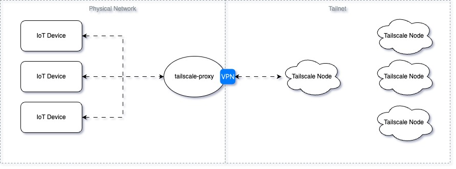

# Tailscale Proxy

[](https://github.com/josuablejeru/tailscale-proxy/blob/main/LICENSE)
[](https://www.buymeacoffee.com/josuablejeru)

Proxy Http calls from your local network to your Tailnet

## Explanation

The program creates a HTTP server listening on the specified port on the local network.
When a request is received, it constructs a new HTTP request directed to the specified Tailscale node (nodeUrl).
It then forwards the request to the Tailscale node using a HTTP client configured to use the Tailscale network.

Upon receiving a response from the Tailscale node, the program forwards the response back to the original requester, effectively acting as a bridge between the local network and the Tailscale network.



## Setup

Before running this program, ensure you have the following prerequisites:

- Tailscale installed and configured on your system.
- Go installed on your system to build and run the program.

export a `TS_AUTHKEY` variable or use the link provided inside your logs

example command:

```bash
tailscale-proxy --nodeUrl='https://influxdb.tailXXXX.ts.net:8086' --port=':8086' --hostname='IotProxy'
```

If you found this program useful, please consider to [buy me a coffee](https://www.buymeacoffee.com/josuablejeru)

## License

This project is licensed under the GNU GPLv3 - see the LICENSE file for details.
